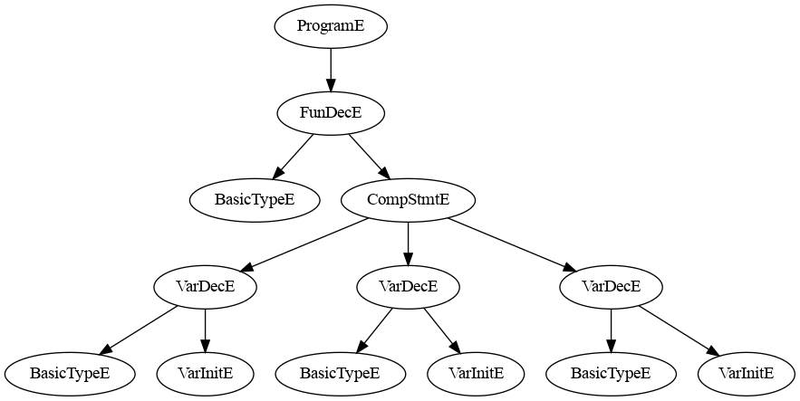
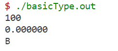
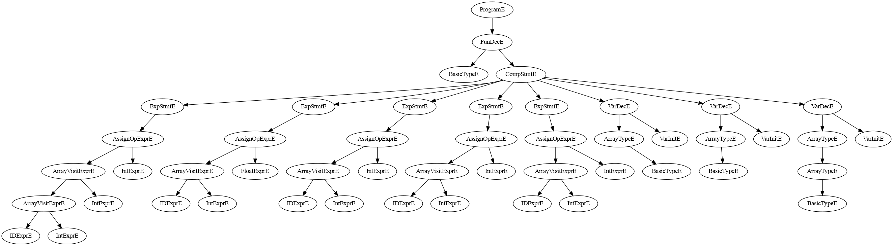

# lexical模块

## 模块简介

该模块是编译器的词法分析模块，它在整个编译器系统中扮演着重要的角色。该模块接收输入流，并根据预先设定的规则将输入转换为一系列词法单元（tokens），以供后续的词法分析使用。作为编译器的起始点，该模块将输入源代码转化为抽象的词法单元序列，为后续的语法分析和语义分析阶段提供基础。

## 设计目的

本模块的设计是为了将源代码的字符流转化为有意义的词法单元，以便进行后续的语法分析和语义分析。通过识别和分类词法单元，编译器可以更好地理解源代码的结构和含义，从而进行有效的编译工作。

## 实现方案

在本模块的设计中，我们选择使用flex作为词法分析器的生成工具。flex提供了强大的正则表达式匹配功能，并且具有高度灵活性和易用性。

我们通过定义一系列正则表达式规则来描述源代码中可能出现的词法单元模式。这些规则按照优先级被灵活地应用于输入的字符流，以匹配和识别对应的词法单元。每当匹配到一个词法单元时，flex将生成相应的token，并通过yyval的值传递相关的属性信息给后续阶段，从而完成整个编译器的实现。

## 特性

本模块使用Flex编写，其中包含一个基于有限自动机（NFA）的词法分析器。该分析器能够以线性时间复杂度对输入的字符流进行处理，具有较高的效率和性能。通过灵活的正则表达式规则和优先级设定，我们可以准确地识别和分类各种词法单元，包括关键字、标识符、常量、运算符等。

## 使用

在整个编译器的编译过程中，本模块应该是最先进行编译的模块。为了生成词法分析模块的C++代码，我们可以使用以下命令：

```bash
flex -o lex.yy.cpp lexical.l
```

这条命令将根据在lexical.l文件中定义的规则生成词法分析器的C++代码，输出到lex.yy.cpp文件中。生成的代码包含了词法分析器的逻辑和功能，可以作为编译器的一部分进行编译和链接。

在编译器的其他模块中，可以引入生成的词法分析器代码，以便在后续的编译过程中使用该模块提供的词法单元序列。


# 语法说明

本次项目中我们实现了一个c语言的子集，包含的表达式、函数定义、数组、控制流语句等基本功能，同时将数组的语法进行了修改，在该版本的c--语言中，数组的定义方法与Java相似，为形如`int[5] array`的形式


$$
\begin{alignat*}{1}
    Program     &\rightarrow \space ExtDefList\\
    ExtDefList  &\rightarrow \space ExtDef  \space ExtDefList\\
                &\rightarrow \space \epsilon\\
    ExtDef      &\rightarrow \space  VarDec\\
                &\rightarrow \space  FunDec\\
    /* Types*/\\
    VarType     &\rightarrow \space  TYPE\\
                &\rightarrow \space  ArrayType\\
    ArrayType   &\rightarrow \space  VarType \space LB \space INT \space RB\\
                &\rightarrow \space  VarType \space LB \space RB\\
    /* Declarations */\\
    VarDec      &\rightarrow \space  VarType \space VarList \space SEMI\\
    VarList     &\rightarrow \space  VarInit \space , \space VarList\\
                &\rightarrow \space  VarInit\\
    VarInit     &\rightarrow \space  ID\\
                &\rightarrow \space  ID \space = \space Exp\\
    FunDec      &\rightarrow \space VarType \space ID \space ( \space ArgList \space ) \space SEMI\\
                &\rightarrow \space VarType \space ID \space ( \space ) \space SEMI\\
                &\rightarrow \space VarType \space ID \space ( .. \space ) \space SEMI\\
                &\rightarrow \space VarType \space ID \space ( \space ArgList \space , \space ... \space ) \space SEMI\\
                &\rightarrow \space VarType \space ID \space ( \space ArgList \space ) \space CompStmt\\
                &\rightarrow \space VarType \space ID \space ( \space ) \space CompStmt\\
    ArgList     &\rightarrow \space ArgList \space , \space Arg\\
                &\rightarrow \space Arg\\
    Arg         &\rightarrow \space VarType \space ID\\
    /* Statements */\\
    CompStmt    &\rightarrow \space \{ \space VarDecList \space StmtList \space \}\\
                &\rightarrow \space error \space \}\\
    StmtList    &\rightarrow \space Stmt \space StmtList\\
                &\rightarrow \space \epsilon\\
    VarDecList  &\rightarrow \space VarDec \space VarDecList\\
                &\rightarrow \space \epsilon\\
    Stmt        &\rightarrow \space Exp \space SEMI\\
                &\rightarrow \space CompStmt\\
                &\rightarrow \space RETURN \space Exp \space SEMI\\
                &\rightarrow \space IF \space ( \space Exp \space ) \space Stmt\\
                &\rightarrow \space IF \space ( \space Exp \space ) \space Stmt \space ELSE \space Stmt\\
                &\rightarrow \space WHILE \space ( \space Exp \space ) \space Stmt\\
                &\rightarrow \space error \space SEMI\\
    /* Expressions */\\
    Exp         &\rightarrow \space Exp \space = \space Exp\\
                &\rightarrow \space Exp \space \&\& \space Exp\\
                &\rightarrow \space Exp \space || \space Exp\\
                &\rightarrow \space Exp \space RELOP \space Exp\\
                &\rightarrow \space Exp \space + \space Exp\\
                &\rightarrow \space Exp \space - \space Exp\\
                &\rightarrow \space Exp \space * \space Exp\\
                &\rightarrow \space Exp \space \backslash \space Exp\\
                &\rightarrow \space ( \space Exp \space )\\
                &\rightarrow \space - \space Exp\\
                &\rightarrow \space ! \space Exp\\
                &\rightarrow \space ID \space ( \space Args \space )\\
                &\rightarrow \space ID \space ( \space )\\
                &\rightarrow \space Exp \space LB \space Exp \space RB\\
                &\rightarrow \space ID\\
                &\rightarrow \space INT\\
                &\rightarrow \space FLOAT\\
    Args        &\rightarrow \space Exp \space , \space Args\\
                &\rightarrow \space Exp\\
    \end{alignat*}
$$


# syntax模块


## 模块概述

syntax模块是编译器的一个重要组成部分，负责解析和语法分析源代码。它接收来自词法模块的词法单元序列，并根据预定义的文法规则识别和分析程序的语法结构。该模块的主要目标是确保输入源代码符合所定义的语法规则，并根据预先定义的语法规则结合其他模块提供的接口进行语法树的生成，该语法树将用于后续的语义分析以及代码生成

## 设计目的

语法模块的设计目的是通过分析不同词法单元及其组合之间的关系，建立程序的层次结构。它基于编程语言定义的文法规则来验证程序的语法正确性。通过成功解析源代码，编译器能够更好地理解程序的结构，并检测出语法错误或歧义，（并尽可能通过错误恢复给出提示信息）。

## 实现方案

在本模块的设计中，我们使用了bison作为语法分析器的生成工具。bison接收语法规则描述文件，根据这些规则生成语法分析器的C++代码。

语法规则文件定义了编程语言的文法规则，通过使用上下文无关文法（CFG）描述源代码的结构。每个规则由非终结符和终结符组成，用于描述语法结构的产生式和语义动作。bison将根据这些规则生成一个LALR(1)分析器，用于解析和分析词法分析模块提供的词法单元序列。

在语法分析过程中，bison会根据规则递归地匹配和分析输入的词法单元序列，生成一个抽象的语法树或其他中间表示形式。同时，可以在语法规则中添加语义动作，用于执行与语法相关的操作，如变量声明、类型检查等。

## 特性

使用Bison实现的语法模块提供以下特性：

1. **语法解析和分析**：该模块对输入的源代码进行解析，并验证其符合定义的语法规则。它分析程序的语法结构，并识别潜在的语法错误；
2. **抽象语法树生成**：在语法分析过程中，该模块与AST模块配合，可以构建抽象语法树（AST），表示程序的层次结构。AST作为后续编译阶段的中间表示形式。
3. **模块化和可扩展性**：生成的解析器代码具有模块化特性，可以轻松地集成到编译器系统中。通过更新文法规范，可以进行文法的修改和增强。


# AST模块

## 模块概述

该模块是编译器的抽象语法树（AST）模块，用于表示源代码的结构和语义信息。它在整个编译器系统中扮演着重要的角色，作为语法分析和语义分析阶段的核心数据结构。

同时在本模块对外提供的接口中，通过节点的构造函数实现AST节点的生成以及提供的codegen函数完成从AST出发的llvm IR的生成

总结来说，AST模块提供了一种将源代码转化为抽象语法树表示，并进一步生成LLVM IR的方式，为后续的代码生成和优化提供了基础。

## 设计目的

本模块的设计是为了将编译器在语法分析阶段生成的语法树进一步转化为更加抽象和可执行的形式，以便进行代码生成和优化。AST模块提供了一种高级表示方式，能够更好地反映源代码的语义结构和意图。

## 实现方案

在本模块的设计中，我们将使用LLVM作为代码生成的后端。AST模块包含了各种类型的AST节点，每个节点都代表源代码的一个特定语法结构（如表达式、语句、函数等）。每个AST节点通过自己的构造函数创建节点实例，并提供虚函数codegen用于代码生成，codeGen通过调用llvm的API将AST转换为llvm的标准IR。

构造函数负责初始化节点的属性和子节点，以构建抽象语法树的层次结构。codegen函数被派生类实现，根据节点的具体类型和语义规则，生成相应的LLVM代码。通过实现codegen函数，AST节点能够将源代码转化为LLVM IR，以便进行进一步的优化和目标代码生成。

## 特性

本模块基于LLVM提供的API，能够与LLVM的IR生成和优化相结合。AST节点的设计充分考虑了源代码的结构和语义规则，以便生成正确且高效的LLVM IR代码。

AST模块具有灵活性和可扩展性，可以支持不同编程语言的语法和语义要求。每个AST节点都可以根据需要添加特定的属性和方法，以适应特定语言的语法和语义规则。

## 使用方法

AST模块应该加入syntax模块中使用，在进行语法分析的同时通过调用对应种类节点的AST的构造函数完成AST的构建。在创建AST节点时，可以根据具体的语法结构和语义规则，为每个节点设置属性和子节点。

在生成代码阶段，通过调用AST节点的codegen函数，将源代码转化为LLVM IR。在调用codegen函数之前，需要创建LLVM上下文和模块，并将这些信息传递给AST节点，以便生成的代码正确地添加到LLVM模块中。

注意，codegen函数应该递归地调用子节点的codegen函数，以确保整个抽象语法树都能正确地转化为LLVM IR。

## AST可视化
为了更好地理解程序的结构和逻辑，项目后期加入了AST的可视化模块，相关代码位于`src/visualization`中。

我们的AST可视化部分主要包含以下几个步骤：

1. 定义AST节点类：我们定义了表示不同类型节点的类，例如Program、VarDec、FunDec等。每个节点类都包含了获取子节点的方法，用于后续遍历。

2. 生成DOT语法：我们编写了一个递归函数`generateDot`，用于为每个节点生成对应的DOT语法。在该函数中，我们为每个节点分配唯一的ID，并根据节点的类型和关系生成相应的DOT语句。

3. 生成DOT文件：我们编写了一个函数`generateDotFile`，该函数接受AST的根节点作为参数，并调用`generateDot`函数生成整个AST的DOT语法。生成的DOT语法被写入到一个DOT文件中，以便后续使用Graphviz进行可视化。

4. 可视化AST：我们使用Graphviz工具来读取生成的DOT文件，并将其转换为可视化图形。通过运行Graphviz命令，我们可以生成AST的可视化结果，展示了程序的结构和层次关系。

# 如何使用本项目
简易的上手教程在readme.md中

本项目后端的代码生成由llvm完成，同时本项目为一个c语言子集的编译器，不涉及链接功能，因此链接部分由ld或者lld完成。
对于生成的中间代码，可以使用clang的wrapper直接编译链接、也可以使用llc编译为汇编后再有gcc提供的warpper进行汇编和链接
当然也可以直接使用llc将IR编译为汇编后使用as进行汇编，并使用ld手动链接所需要的运行时c库
已经将三种不同的方式的脚本放在了script文件夹中

# 测试案例

## 数据类型测试

### 基本类型测试
1. 测试代码
    ```c
    int main()
    {
        int a=100;
        float b=0.0;
        int c;
        c = -2;
    }
    ```
2. AST
    

3. IR
    ```asm
    ; ModuleID = 'main'
    source_filename = "main"

    define i32 @main() {
    entry:
    %a = alloca i32
    %b = alloca float
    %c = alloca i32
    store float 0.000000e+00, float* %b
    store i32 100, i32* %a
    store i32 -2, i32* %c
    ret i32 undef
    }
    ```

4. 运行结果(添加输出)

    

### 数组类型测试
1. 测试代码
    ```c
    int main()
    {
        int[3][2] a;
        float[2] b;
        a[2][1] = 5;
        b[1] = 0.0;
    }
    ```
2. AST
    

3. IR
    ```asm
    ; ModuleID = 'main'
    source_filename = "main"

    define i32 @main() {
    entry:
    %a = alloca [2 x [3 x i32]]
    %b = alloca [2 x float]
    %arraytmp = getelementptr [2 x [3 x i32]], [2 x [3 x i32]]* %a, i32 0, i32 2
    %arraytmp1 = getelementptr [3 x i32], [3 x i32]* %arraytmp, i32 0, i32 1
    store i32 5, i32* %arraytmp1
    %arraytmp2 = getelementptr [2 x float], [2 x float]* %b, i32 0, i32 1
    store float 0.000000e+00, float* %arraytmp2
    ret i32 undef
    }
    ```

4. 运行结果(添加输出)

    


### 类型转换测试
1. 测试代码
    ```c
    int main()
    {
        float b=5.5;
        int c=0;
        b = c;
    }
    ```
2. AST

    

3. IR
    ```asm
    ; ModuleID = 'main'
    source_filename = "main"

    define i32 @main() {
    entry:
    %b = alloca float
    %c = alloca i32
    store i32 0, i32* %c
    store float 5.500000e+00, float* %b
    %0 = load i32, i32* %c
    %1 = bitcast i32 %0 to float
    store float %1, float* %b
    ret i32 undef
    }
    ```
4. 运行结果(添加输出)

    

## 表达式测试
1. 测试代码
    ```c
    int main()
    {
        int[3] a;
        int b, c;
        a[0] = 1;
        b=2;
        a[1] = b/2+5;
        c=-b;
        b = c+b;
        a[2] = a[1] * c;
    }
    ```
2. AST

    

3. IR
    ```asm
    ; ModuleID = 'main'
    source_filename = "main"

    define i32 @main() {
    entry:
    %a = alloca [3 x i32]
    %b = alloca i32
    %c = alloca i32
    %arraytmp = getelementptr [3 x i32], [3 x i32]* %a, i32 0, i32 0
    store i32 1, i32* %arraytmp
    store i32 2, i32* %b
    %arraytmp1 = getelementptr [3 x i32], [3 x i32]* %a, i32 0, i32 1
    %0 = load i32, i32* %b
    %divtmp = sdiv i32 %0, 2
    %addtmp = add i32 %divtmp, 5
    store i32 %addtmp, i32* %arraytmp1
    %1 = load i32, i32* %b
    %negtmp = sub i32 0, %1
    store i32 %negtmp, i32* %c
    %2 = load i32, i32* %c
    %3 = load i32, i32* %b
    %addtmp2 = add i32 %2, %3
    store i32 %addtmp2, i32* %b
    %arraytmp3 = getelementptr [3 x i32], [3 x i32]* %a, i32 0, i32 2
    %arraytmp4 = getelementptr [3 x i32], [3 x i32]* %a, i32 0, i32 1
    %arrayloadtmp = load i32, i32* %arraytmp4
    %4 = load i32, i32* %c
    %multmp = mul i32 %arrayloadtmp, %4
    store i32 %multmp, i32* %arraytmp3
    ret i32 undef
    }
    ```

4. 运行结果(添加输出)

    

## 语句测试

### If语句测试
1. 测试代码
    ```c
    int main()
    {
        int a = 54;
        int flag;
        if(a<10) flag = 1;
        else flag = 0;
        return 0;
    }
    ```

2. AST

    

3. IR
    ```asm
    ; ModuleID = 'main'
    source_filename = "main"

    define i32 @main() {
    entry:
    %a = alloca i32
    %flag = alloca i32
    store i32 54, i32* %a
    %0 = load i32, i32* %a
    %lttmp = icmp slt i32 %0, 10
    br i1 %lttmp, label %then, label %else

    then:                                             ; preds = %entry
    store i32 1, i32* %flag
    br label %ifcont

    else:                                             ; preds = %entry
    br label %ifcont

    ifcont:                                           ; preds = %else, %then
    ret i32 0
    }
    ```

### While语句测试
1. 测试代码
    ```c
    int main()
    {
        int a = 54, cnt = 0;
        while(a>0) {
            cnt = cnt+1;
            a = a/2;
        }
        return 0;
    }
    ```

2. AST

    

3. IR
    ```asm
    ; ModuleID = 'main'
    source_filename = "main"

    define i32 @main() {
    entry:
    %a = alloca i32
    %cnt = alloca i32
    store i32 0, i32* %cnt
    store i32 54, i32* %a
    br label %whilecond

    whilecond:                                        ; preds = %whilebody, %entry
    %0 = load i32, i32* %a
    %gttmp = icmp sgt i32 %0, 0
    br i1 %gttmp, label %whilebody, label %whilecont

    whilebody:                                        ; preds = %whilecond
    %1 = load i32, i32* %cnt
    %addtmp = add i32 %1, 1
    store i32 %addtmp, i32* %cnt
    %2 = load i32, i32* %a
    %divtmp = sdiv i32 %2, 2
    store i32 %divtmp, i32* %a
    br label %whilecond

    whilecont:                                        ; preds = %whilecond
    ret i32 0
    }
    ```

### Return语句测试
1. 测试代码
    ```c
    int main()
    {
        return 0;
    }
    ```

2. AST

    

3. IR
    ```asm
    ; ModuleID = 'main'
    source_filename = "main"

    define i32 @main() {
    entry:
    ret i32 0
    }
    ```

## 函数测试

### 简单函数
1. 测试代码
    ```c
    int putchar(int a);
    int printf(char[] pattern,...);
    int scanf(char[] pattern,...);
    int readInt(){
        char[5] p;
        int[1] scanfRes;
        p[0] = 37;
        p[1] = 100;
        p[2] = 0; 
        scanf(p,scanfRes);
        return scanfRes[0];
    }
    int printInt(int x) {
        char[5] p;
        p[0] = 37;
        p[1] = 100;
        p[2] = 0;
        printf(p,x);
        return 0;
    }

    int add(int a, int b) {
        return a+b;
    }

    int main()
    {
        int a, b;
        a = readInt();
        b = readInt();
        printInt(add(a,b));
        putchar(10);
    }
    ```

2. AST

    

3. IR
    ```asm
    ; ModuleID = 'main'
    source_filename = "main"

    declare i32 @putchar(i32)

    declare i32 @printf(i8*, ...)

    declare i32 @scanf(i8*, ...)

    define i32 @readInt() {
    entry:
    %p = alloca [5 x i8]
    %scanfRes = alloca [1 x i32]
    %arraytmp = getelementptr [5 x i8], [5 x i8]* %p, i32 0, i32 0
    store i8 37, i8* %arraytmp
    %arraytmp1 = getelementptr [5 x i8], [5 x i8]* %p, i32 0, i32 1
    store i8 100, i8* %arraytmp1
    %arraytmp2 = getelementptr [5 x i8], [5 x i8]* %p, i32 0, i32 2
    store i8 0, i8* %arraytmp2
    %arraytmp3 = getelementptr [5 x i8], [5 x i8]* %p, i32 0, i32 0
    %arraytmp4 = getelementptr [1 x i32], [1 x i32]* %scanfRes, i32 0, i32 0
    %calltmp = call i32 (i8*, ...) @scanf(i8* %arraytmp3, i32* %arraytmp4)
    %arraytmp5 = getelementptr [1 x i32], [1 x i32]* %scanfRes, i32 0, i32 0
    %arrayloadtmp = load i32, i32* %arraytmp5
    ret i32 %arrayloadtmp
    }

    define i32 @printInt(i32 %x) {
    entry:
    %p = alloca [5 x i8]
    %x1 = alloca i32
    store i32 %x, i32* %x1
    %arraytmp = getelementptr [5 x i8], [5 x i8]* %p, i32 0, i32 0
    store i8 37, i8* %arraytmp
    %arraytmp2 = getelementptr [5 x i8], [5 x i8]* %p, i32 0, i32 1
    store i8 100, i8* %arraytmp2
    %arraytmp3 = getelementptr [5 x i8], [5 x i8]* %p, i32 0, i32 2
    store i8 0, i8* %arraytmp3
    %arraytmp4 = getelementptr [5 x i8], [5 x i8]* %p, i32 0, i32 0
    %0 = load i32, i32* %x1
    %calltmp = call i32 (i8*, ...) @printf(i8* %arraytmp4, i32 %0)
    ret i32 0
    }

    define i32 @add(i32 %a, i32 %b) {
    entry:
    %b2 = alloca i32
    %a1 = alloca i32
    store i32 %a, i32* %a1
    store i32 %b, i32* %b2
    %0 = load i32, i32* %a1
    %1 = load i32, i32* %b2
    %addtmp = add i32 %0, %1
    ret i32 %addtmp
    }

    define i32 @main() {
    entry:
    %a = alloca i32
    %b = alloca i32
    %calltmp = call i32 @readInt()
    store i32 %calltmp, i32* %a
    %calltmp1 = call i32 @readInt()
    store i32 %calltmp1, i32* %b
    %0 = load i32, i32* %a
    %1 = load i32, i32* %b
    %calltmp2 = call i32 @add(i32 %0, i32 %1)
    %calltmp3 = call i32 @printInt(i32 %calltmp2)
    %calltmp4 = call i32 @putchar(i32 10)
    ret i32 undef
    }
    ```
4. 运行结果

    

### 递归函数

1. 测试代码
    ```c
    int putchar(int a);
    int printf(char[] pattern,...);
    int scanf(char[] pattern,...);
    int readInt(){
        char[5] p;
        int[1] scanfRes;
        p[0] = 37;
        p[1] = 100;
        p[2] = 0; 
        scanf(p,scanfRes);
        return scanfRes[0];
    }
    int printInt(int x) {
        char[5] p;
        p[0] = 37;
        p[1] = 100;
        p[2] = 0;
        printf(p,x);
        return 0;
    }

    int f(int n) {
        if(n==0) return 1;
        return n*f(n-1);
    }

    int main()
    {
        int a, b;
        a = readInt();
        printInt(f(a));
        putchar(10);
    }
    ```

2. AST

    

3. IR
    ```asm
    ; ModuleID = 'main'
    source_filename = "main"

    declare i32 @putchar(i32)

    declare i32 @printf(i8*, ...)

    declare i32 @scanf(i8*, ...)

    define i32 @readInt() {
    entry:
    %p = alloca [5 x i8]
    %scanfRes = alloca [1 x i32]
    %arraytmp = getelementptr [5 x i8], [5 x i8]* %p, i32 0, i32 0
    store i8 37, i8* %arraytmp
    %arraytmp1 = getelementptr [5 x i8], [5 x i8]* %p, i32 0, i32 1
    store i8 100, i8* %arraytmp1
    %arraytmp2 = getelementptr [5 x i8], [5 x i8]* %p, i32 0, i32 2
    store i8 0, i8* %arraytmp2
    %arraytmp3 = getelementptr [5 x i8], [5 x i8]* %p, i32 0, i32 0
    %arraytmp4 = getelementptr [1 x i32], [1 x i32]* %scanfRes, i32 0, i32 0
    %calltmp = call i32 (i8*, ...) @scanf(i8* %arraytmp3, i32* %arraytmp4)
    %arraytmp5 = getelementptr [1 x i32], [1 x i32]* %scanfRes, i32 0, i32 0
    %arrayloadtmp = load i32, i32* %arraytmp5
    ret i32 %arrayloadtmp
    }

    define i32 @printInt(i32 %x) {
    entry:
    %p = alloca [5 x i8]
    %x1 = alloca i32
    store i32 %x, i32* %x1
    %arraytmp = getelementptr [5 x i8], [5 x i8]* %p, i32 0, i32 0
    store i8 37, i8* %arraytmp
    %arraytmp2 = getelementptr [5 x i8], [5 x i8]* %p, i32 0, i32 1
    store i8 100, i8* %arraytmp2
    %arraytmp3 = getelementptr [5 x i8], [5 x i8]* %p, i32 0, i32 2
    store i8 0, i8* %arraytmp3
    %arraytmp4 = getelementptr [5 x i8], [5 x i8]* %p, i32 0, i32 0
    %0 = load i32, i32* %x1
    %calltmp = call i32 (i8*, ...) @printf(i8* %arraytmp4, i32 %0)
    ret i32 0
    }

    define i32 @f(i32 %n) {
    entry:
    %n1 = alloca i32
    store i32 %n, i32* %n1
    %0 = load i32, i32* %n1
    %eqtmp = icmp eq i32 %0, 0
    br i1 %eqtmp, label %then, label %else

    then:                                             ; preds = %entry
    ret i32 1

    else:                                             ; preds = %entry
    br label %ifcont

    ifcont:                                           ; preds = %else, <badref>
    %1 = load i32, i32* %n1
    %2 = load i32, i32* %n1
    %subtmp = sub i32 %2, 1
    %calltmp = call i32 @f(i32 %subtmp)
    %multmp = mul i32 %1, %calltmp
    ret i32 %multmp
    }

    define i32 @main() {
    entry:
    %a = alloca i32
    %b = alloca i32
    %calltmp = call i32 @readInt()
    store i32 %calltmp, i32* %a
    %0 = load i32, i32* %a
    %calltmp1 = call i32 @f(i32 %0)
    %calltmp2 = call i32 @printInt(i32 %calltmp1)
    %calltmp3 = call i32 @putchar(i32 10)
    ret i32 undef
    }
    ```
4. 运行结果

    

## 综合测试
此部分测试样例的AST可视化图和IR代码均过长，不予赘述。
### 快速排序

1. 测试代码

    见`../test/1.cmm`.

2. 运行结果

    
    
    
3. 测试结果

    

### 矩阵乘法

1. 测试代码

    见`../test/2.cmm`.

2. 运行结果

    
    

3. 测试结果

    

