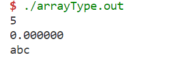

# lexical模块

## 模块简介

该模块是编译器的词法分析模块，它在整个编译器系统中扮演着重要的角色。该模块接收输入流，并根据预先设定的规则将输入转换为一系列词法单元（tokens），以供后续的词法分析使用。作为编译器的起始点，该模块将输入源代码转化为抽象的词法单元序列，为后续的语法分析和语义分析阶段提供基础。

## 设计目的

本模块的设计是为了将源代码的字符流转化为有意义的词法单元，以便进行后续的语法分析和语义分析。通过识别和分类词法单元，编译器可以更好地理解源代码的结构和含义，从而进行有效的编译工作。

## 实现方案

在本模块的设计中，我们选择使用flex作为词法分析器的生成工具。flex提供了强大的正则表达式匹配功能，并且具有高度灵活性和易用性。

我们通过定义一系列正则表达式规则来描述源代码中可能出现的词法单元模式。这些规则按照优先级被灵活地应用于输入的字符流，以匹配和识别对应的词法单元。每当匹配到一个词法单元时，flex将生成相应的token，并通过yyval的值传递相关的属性信息给后续阶段，从而完成整个编译器的实现。

## 特性

本模块使用Flex编写，其中包含一个基于有限自动机（NFA）的词法分析器。该分析器能够以线性时间复杂度对输入的字符流进行处理，具有较高的效率和性能。通过灵活的正则表达式规则和优先级设定，我们可以准确地识别和分类各种词法单元，包括关键字、标识符、常量、运算符等。

## 使用

在整个编译器的编译过程中，本模块应该是最先进行编译的模块。为了生成词法分析模块的C++代码，我们可以使用以下命令：

```bash
flex -o lex.yy.cpp lexical.l
```

这条命令将根据在lexical.l文件中定义的规则生成词法分析器的C++代码，输出到lex.yy.cpp文件中。生成的代码包含了词法分析器的逻辑和功能，可以作为编译器的一部分进行编译和链接。

在编译器的其他模块中，可以引入生成的词法分析器代码，以便在后续的编译过程中使用该模块提供的词法单元序列。


# syntax模块


## 模块概述

syntax模块是编译器的一个重要组成部分，负责解析和语法分析源代码。它接收来自词法模块的词法单元序列，并根据预定义的文法规则识别和分析程序的语法结构。该模块的主要目标是确保输入源代码符合所定义的语法规则，并根据预先定义的语法规则结合其他模块提供的接口进行语法树的生成，该语法树将用于后续的语义分析以及代码生成

## 设计目的

语法模块的设计目的是通过分析不同词法单元及其组合之间的关系，建立程序的层次结构。它基于编程语言定义的文法规则来验证程序的语法正确性。通过成功解析源代码，编译器能够更好地理解程序的结构，并检测出语法错误或歧义，（并尽可能通过错误恢复给出提示信息）。

## 实现方案

在本模块的设计中，我们使用了bison作为语法分析器的生成工具。bison接收语法规则描述文件，根据这些规则生成语法分析器的C++代码。

语法规则文件定义了编程语言的文法规则，通过使用上下文无关文法（CFG）描述源代码的结构。每个规则由非终结符和终结符组成，用于描述语法结构的产生式和语义动作。bison将根据这些规则生成一个LALR(1)分析器，用于解析和分析词法分析模块提供的词法单元序列。

在语法分析过程中，bison会根据规则递归地匹配和分析输入的词法单元序列，生成一个抽象的语法树或其他中间表示形式。同时，可以在语法规则中添加语义动作，用于执行与语法相关的操作，如变量声明、类型检查等。

## 特性

使用Bison实现的语法模块提供以下特性：

1. **语法解析和分析**：该模块对输入的源代码进行解析，并验证其符合定义的语法规则。它分析程序的语法结构，并识别潜在的语法错误；
2. **抽象语法树生成**：在语法分析过程中，该模块与AST模块配合，可以构建抽象语法树（AST），表示程序的层次结构。AST作为后续编译阶段的中间表示形式。
3. **模块化和可扩展性**：生成的解析器代码具有模块化特性，可以轻松地集成到编译器系统中。通过更新文法规范，可以进行文法的修改和增强。


# AST模块

## 模块概述

该模块是编译器的抽象语法树（AST）模块，用于表示源代码的结构和语义信息。它在整个编译器系统中扮演着重要的角色，作为语法分析和语义分析阶段的核心数据结构。

同时在本模块对外提供的接口中，通过节点的构造函数实现AST节点的生成以及提供的codegen函数完成从AST出发的llvm IR的生成

总结来说，AST模块提供了一种将源代码转化为抽象语法树表示，并进一步生成LLVM IR的方式，为后续的代码生成和优化提供了基础。

## 设计目的

本模块的设计是为了将编译器在语法分析阶段生成的语法树进一步转化为更加抽象和可执行的形式，以便进行代码生成和优化。AST模块提供了一种高级表示方式，能够更好地反映源代码的语义结构和意图。

## 实现方案

在本模块的设计中，我们将使用LLVM作为代码生成的后端。AST模块包含了各种类型的AST节点，每个节点都代表源代码的一个特定语法结构（如表达式、语句、函数等）。每个AST节点通过自己的构造函数创建节点实例，并提供虚函数codegen用于代码生成，codeGen通过调用llvm的API将AST转换为llvm的标准IR。

构造函数负责初始化节点的属性和子节点，以构建抽象语法树的层次结构。codegen函数被派生类实现，根据节点的具体类型和语义规则，生成相应的LLVM代码。通过实现codegen函数，AST节点能够将源代码转化为LLVM IR，以便进行进一步的优化和目标代码生成。

## 特性

本模块基于LLVM提供的API，能够与LLVM的IR生成和优化相结合。AST节点的设计充分考虑了源代码的结构和语义规则，以便生成正确且高效的LLVM IR代码。

AST模块具有灵活性和可扩展性，可以支持不同编程语言的语法和语义要求。每个AST节点都可以根据需要添加特定的属性和方法，以适应特定语言的语法和语义规则。

## AST节点

我们定义的AST节点之间继承关系如下：


接下来依次介绍各节点类型。

### Node类

Node是所有类型的公共父类，实现单根结构，其中包含公共的CodeGen函数用于代码生成。

```c++
class Node {
    public:
        Node(){}
        ~Node() {}
        virtual llvm::Value* CodeGen(CodeGenContext& context) = 0;
};
```

### Program类

Program是AST的根节点，由若干Declaration组成，代码生成时依次生成其中每条语句的代码。

```cpp
class Program : public Node {
    public:
        std::vector<Declaration*>* _decs;
        Program(std::vector<Declaration*>* __decs):_decs(__decs){};
        ~Program(){};
        llvm::Value* CodeGen(CodeGenContext& context);
};
```

### Declaration类

声名的接口类，有变量声明、函数声明两种。

```cpp
class Declaration : public Node {
    public:
        Declaration(){}
        ~Declaration(){}
        virtual llvm::Value* CodeGen(CodeGenContext& context) = 0;
};
```

#### VarDec类

变量声明，语法为`VarDec -> VarType VarList SEMI`，用于一次性声明同一类型的若干变量，且需要同时包含变量初始化。

```cpp
class VarDec : public Declaration {
    public:
        VarType* _VarType;
        VarList* _VarList;
        VarDec():_VarType(nullptr), _VarList(nullptr) {}
        VarDec(VarType* __VarType, VarList* __VarList):_VarType(__VarType), _VarList(__VarList){};
        ~VarDec(){};
        llvm::Value* CodeGen(CodeGenContext& context);
};
```

##### VarInit类

单个变量的初始化，语法为`VarInit -> ID AssignOP Exp | ID`。

```cpp
class VarInit : public VarDec {
    public:
        std::string _name;      //variable name
        Expression* _value;      // possible value
        VarInit(const std::string& __name, Expression* __value):_name(__name), _value(__value){}
        ~VarInit(){}
        llvm::Value* CodeGen(CodeGenContext& context);
};
```

##### VarList类

变量声明的列表，用于描述若干变量的声明/初始化，为一个VarInit类指针的Vector，具体实现为`using VarList = std::vector<VarInit*>;`，其语法为`VarList -> VarInit COMMA VarList | VarInit`。

#### FunDec类

函数的声明，需要包含函数的返回类型、函数名、参数列表以及函数体（可以为空，对应函数声明，否则是函数定义），变量`_is_va`用于识别该函数是不是可变参数的函数。

```cpp
class FunDec : public Declaration {
    public:
        VarType* _returnType;   //return type
        std::string _name;      //function name
        ArgList* _args;         //arguments
        CompStmt* _body;         //function body
        bool _is_va;
        FunDec() : _returnType(nullptr), _args(nullptr), _body(nullptr),_is_va(false) {}
        FunDec(VarType* __returnType, const std::string& __name, ArgList* __args, CompStmt* __body,bool _is_va):_returnType(__returnType), _name(__name), _args(__args), _body(__body),_is_va(_is_va){};
        ~FunDec(){};
        llvm::Value* CodeGen(CodeGenContext& context);
};  
```

##### Arg类

函数参数节点，语法为`Arg -> VarType ID`，用作函数的参数，包含参数类型、参数名。

```cpp
class Arg : public FunDec {
    public:
        VarType* _type;
        std::string _name;
        Arg(VarType* __type, std::string __name):_type(__type), _name(__name){};
        ~Arg(){};
        llvm::Value* CodeGen(CodeGenContext& context) {return nullptr;}
};
```

##### ArgList类

参数列表，即一系列的参数，语法为`ArgList -> COMMA Arg | Arg`，实现为Arg指针的vector。

### VarType类

变量类型的接口类，用于声明/定义变量时解析变量类型，包含有基础类型、数组类型两种。需要提供`GetType`方法来获取相应类型。

```cpp
class VarType : public Node {
    public:
        llvm::Type* _type;
        VarType(void):_type(nullptr){}
        ~VarType(){}
        virtual llvm::Type* GetType(CodeGenContext& context) = 0;
        virtual llvm::Value* CodeGen(CodeGenContext& context) {return nullptr;}
};
```

#### BasicType类

用于表示基础类型，包括`int/float/char`三种。

```cpp
class BasicType : public VarType {
    public:
        enum TypeID {
            _int,
            _float,
            _char,
        };
        TypeID _type;
        BasicType(TypeID __type):_type(__type){};
        ~BasicType(){};
        llvm::Type* GetType(CodeGenContext& context);
};
```

#### ArrayType类

可实现多维数组，其参数包括（该维）数组的大小、数组元素的类型，其中数组元素可以也为数组类，由此实现多维数组。语法为`ArrayType -> VarType LB INT RB | VarType LB RB`。我们允许数组大小为0，此时表示相应的指针。

```cpp
class ArrayType : public VarType {
    public:
        VarType* _type;
        int _size;
        ArrayType(VarType* __type, int __size):_type(__type), _size(__size){};
        ~ArrayType(){};
        llvm::Type* GetType(CodeGenContext& context);
};
```

### Statement类

语句类型，接口类，包括`If/While`等语句子类。

```cpp
class Statement : public Node {
    public:
        Statement(){}
        ~Statement(){}
        virtual llvm::Value* CodeGen(CodeGenContext& context) = 0;
};
```

#### CompStmt类

复杂语句类，由若干语句和变量声明构成，其具体表现为由一个大括号中所包含的内容组成一个语句，其中需要在头部完成所有变量的声明，然后展开各种语句。语法为`CompStmt - > LC VarDecList StmtList RC`。

```cpp
class CompStmt : public Statement {
    public:
        std::vector<Statement*>* _stmts;
        std::vector<VarDec*> * _varDecs;
        CompStmt(std::vector<VarDec*> * _varDecs,std::vector<Statement*>* __stmts):_stmts(__stmts),_varDecs(_varDecs){};
        ~CompStmt(){};
        llvm::Value* CodeGen(CodeGenContext& context);
};
```

#### ExpStmt类

单个表达式作为语句，语法为`Stmt -> Exp SEMI`，为其中的Exp构造相应的`ExpStmt`，需要在其中包含

```cpp
class ExpStmt : public Statement {
    public:
        Expression* _exp;
        ExpStmt(Expression* _exp):_exp(_exp){};
        ~ExpStmt(){};
        llvm::Value* CodeGen(CodeGenContext& context);
};
```

#### IfStmt类

条件语句，语法为`Stmt -> IF LP Exp RP Stmt %prec LOWER_THAN_ELSE | IF LP Exp RP Stmt ELSE Stmt`，其中有else的语句在parser中是优先于没有的。需要包含判断条件、`if`部分执行语句、`else`部分执行语句。

```cpp
class IfStmt : public Statement {
    public:
        Expression* _cond;
        Statement* _then;
        Statement* _else;
        IfStmt(Expression* __cond, Statement* __then, Statement* __else = nullptr):_cond(__cond), _then(__then), _else(__else){};
        ~IfStmt(){};
        llvm::Value* CodeGen(CodeGenContext& context);
};
```

#### RetStmt类

返回语句，可以返回一个表达式，语法为`Stmt -> RETURN Exp SEMI`

```cpp
class RetStmt : public Statement {
    public:
        Expression* _retval;
        RetStmt(Expression* __retval):_retval(__retval){};
        ~RetStmt(){};
        llvm::Value* CodeGen(CodeGenContext& context);
};
```

#### WhileStmt类

循环语句，包括整个循环条件以及循环体，语法为`Stmt -> WHILE LP Exp RP Stmt`

```cpp
class WhileStmt : public Statement {
    public:
        Expression* _cond;
        Statement* _body;
        WhileStmt(Expression* __cond, Statement* __body):_cond(__cond), _body(__body){};
        ~WhileStmt(){};
        llvm::Value* CodeGen(CodeGenContext& context);
};
```

### Expression类

表达式类型，接口类，包括二元运算、赋值运算、取反运算等子类。

```cpp
class Expression : public Node {
    public:
        Expression(){}
        ~Expression(){}
        virtual llvm::Value* CodeGen(CodeGenContext& context) = 0;
};
```

#### AssignOpExpr类

赋值表达式，需要记录左右两方的表达式。

```cpp
class AssignOpExpr : public Expression {
    public:
        std::string identifier; //identifier
        Expression* LHS;
        Expression* RHS;
        AssignOpExpr(Expression* LHS, Expression* RHS):LHS(LHS), RHS(RHS){};
        llvm::Value* CodeGen(CodeGenContext& context);
};
```

#### BinaryOpExpr类

二元表达式，包括求和/关系运算等等，需要操作符、两个操作表达式。

```cpp
class BinaryOpExpr : public Expression{
    public:
        std::string Operator;//AND\OR\RELOP\PLUS...
        Expression* LHS;
        Expression* RHS;
        BinaryOpExpr(std::string Operator, Expression* LHS, Expression* RHS):Operator(Operator), LHS(LHS), RHS(RHS){};
        ~BinaryOpExpr() {};
        llvm::Value* CodeGen(CodeGenContext& context);
};
```

#### ArrayVisitExpr类

数组访问表达式，返回数组元素，需要提供数组表达式和所要访问的下标。

```cpp
class ArrayVisitExpr : public Expression{
    public:
        Expression* Array;
        Expression* Index;
        ArrayVisitExpr(Expression* Array, Expression* Index):Array(Array), Index(Index){};
        ~ArrayVisitExpr(){};
        llvm::Value* CodeGen(CodeGenContext& context);
};
```

#### CallFuncExpr类

函数调用表达式，需要提供函数名、参数列表。

```cpp
class CallFuncExpr : public Expression{
public:
    std::string _name;
    Args * _args;
    CallFuncExpr(std::string _name,Args * _args):_name(_name),_args(_args){};
    ~CallFuncExpr(){};
    llvm::Value* CodeGen(CodeGenContext& context);
};
```

## 使用方法

AST模块应该加入syntax模块中使用，在进行语法分析的同时通过调用对应种类节点的AST的构造函数完成AST的构建。在创建AST节点时，可以根据具体的语法结构和语义规则，为每个节点设置属性和子节点。

在生成代码阶段，通过调用AST节点的codegen函数，将源代码转化为LLVM IR。在调用codegen函数之前，需要创建LLVM上下文和模块，并将这些信息传递给AST节点，以便生成的代码正确地添加到LLVM模块中。

注意，codegen函数应该递归地调用子节点的codegen函数，以确保整个抽象语法树都能正确地转化为LLVM IR。

## AST可视化
为了更好地理解程序的结构和逻辑，项目后期加入了AST的可视化模块，相关代码位于`src/visualization`中。

我们的AST可视化部分主要包含以下几个步骤：

1. 定义AST节点类：我们定义了表示不同类型节点的类，例如Program、VarDec、FunDec等。每个节点类都包含了获取子节点的方法，用于后续遍历。

2. 生成DOT语法：我们编写了一个递归函数`generateDot`，用于为每个节点生成对应的DOT语法。在该函数中，我们为每个节点分配唯一的ID，并根据节点的类型和关系生成相应的DOT语句。

3. 生成DOT文件：我们编写了一个函数`generateDotFile`，该函数接受AST的根节点作为参数，并调用`generateDot`函数生成整个AST的DOT语法。生成的DOT语法被写入到一个DOT文件中，以便后续使用Graphviz进行可视化。

4. 可视化AST：我们使用Graphviz工具来读取生成的DOT文件，并将其转换为可视化图形。通过运行Graphviz命令，我们可以生成AST的可视化结果，展示了程序的结构和层次关系。

# 语义分析

## 模块概述

本模块将语法分析得到的抽象语法树进行优化，保证语法的正确，并进行相关的附加动作，以便于之后的代码生成。其中我们在这一步同时完成了语义分析以及中间代码的生成。

## 设计目的

本模块的目的有：

1. 在编译过程中检查程序是否存在语义错误，如类型不匹配、未定义的符号等。
2. 生成符号表，用于记录程序中的所有标识符和它们的属性信息，如名字、类型、作用域等。
3. 进行类型检查，如检查变量的类型是否与运算符匹配，函数参数的类型是否正确等。
4. 生成中间代码，便于后续优化和代码生成。

## 实现方案

本模块基于LLVM API，对每一条语句/表达式进行语义分析并生成中间代码。同时，我们构建了`CodeGenContext`用于完成上下文环境的维护。各部分实现介绍如下：

### 全局相关

我们整个程序将由`Program`来表示，相应的CFG如下：

```yacc
Program     : ExtDefList                        {reverse($1->begin(),$1->end());p = new AST::Program($1);}
            ;           
ExtDefList  : ExtDef ExtDefList                 {$2->push_back($1);$$ = $2;}
            | /* empty */                       {$$ = new AST::ExtDefList();}
            ;
ExtDef      : VarDec                            {$$ = $1;}
            | FunDec                            {$$ = $1;}
            ;                         
```

其中`Program`由若干个`ExtDef`组成，即包含了若干的全局变量声明和函数声明。由于语句是倒序进栈，因此需要对解析出的`ExtDefList`做`reverse`的操作。其中生成的`AST::ExtDeflist()`对象就是`Declaration`的一个`vector`，声明为`using ExtDefList = std::vector<Declaration *>;`。

在生成IR代码时，调用`Program`的`CodeGen`就是遍历其中所有的语句，并依次执行其`CodeGen`：

```cpp
llvm::Value* Program::CodeGen(CodeGenContext& context){
    for(auto& dec : *(this->_decs)){
        dec->CodeGen(context);
    }
    return NULL;
}
```

### VarType相关

`VarType`相关的CFG如下：

```cpp
VarType     : TYPE      {$$ = new AST::BasicType($1);}
            | ArrayType {$$ = $1;}
            ;
```

`VarType`是所有类型类的基类接口，其实现的子类有`BasicType`和`ArrayType`，需要提供`GetType`方法来获取相关的类型。

#### BasicType类

有int/float/char三种基础类型组成，在其中有一个`TypeID _type`类进行记录，在GetType时基于该值进行相应的返回即可。

```cpp
llvm::Type* BasicType::GetType(CodeGenContext& context){
    llvm::LLVMContext& llvmContext = context.getLLVMContext();
    switch (this->_type) {
        case _int:
            return llvm::Type::getInt32Ty(llvmContext);
        case _float:
            return llvm::Type::getFloatTy(llvmContext);
        case _char:
            return llvm::Type::getInt8Ty(llvmContext);
        default:
            //Unkown type
            std::cerr << "Unkown type" << std::endl;
            return NULL;
    }
}
```

#### ArrayType类

`ArrayType`中有一个`VarType`对象，以实现数组的嵌套（多维数组）。我们首先通过`GetType`获取该维数组所在的元素类型，然后根据该类型创建一个相应的数组或指针即可。

```cpp
llvm::Type* ArrayType::GetType(CodeGenContext& context){
    llvm::Type* elementType = this->_type->GetType(context);
    if (!elementType) {
        //Invalid element type
        std::cerr << "Invalid element type" << std::endl;
        return NULL;
    }
    //create array type
    if (this->_size == 0) {
        //create pointer type
        return llvm::PointerType::get(elementType, 0);
    }
    //create array type
    return llvm::ArrayType::get(elementType, this->_size);
}
```

### Declaration相关

我们之前看到，Declaration有VarDec和FunDec两种，我们分别对其进行介绍。

#### VarDec类

VarDec实现变量声明/定义，一次性实现多个同类型变量的定义并要求初始化。

```cpp
VarDec      : VarType VarList SEMI              {$$ = new AST::VarDec($1,$2);}
            ; 

VarList     : VarInit COMMA VarList             {$3->push_back($1);$$ = $3;}
            | VarInit                           {$$ = new AST::VarList();$$->push_back($1);}
            ;
VarInit     : ID                                {$$ = new AST::VarInit(*$1,NULL);}
            | ID ASSIGNOP Exp                   {$$ = new AST::VarInit(*$1,$3);}
            /* Exp should be constant*/
            ;
```

其中每个变量的初始化由VarInit完成，CodeGen只需要调用每一个VarInit的CodeGen即可：

```cpp
llvm::Value* VarDec::CodeGen(CodeGenContext& context){
    if(_VarList != NULL){
        for(auto& var : *(_VarList)){
            var->_VarType = this->_VarType;
            var->CodeGen(context);  //Generate code for each var
        }
    }
    return NULL;
}
```

##### VarInit类

VarInit完成单个变量的初始化。

```cpp
llvm::Value* VarInit::CodeGen(CodeGenContext& context){
    llvm::Value* initVal = NULL;
    if(_value != NULL){
        initVal = _value->CodeGen(context); //Generate code for init value
    }
    llvm::AllocaInst* alloca = context.createEntryBlockAlloca(_VarType->GetType(context), _name);
    context.createSymbolTableEntry(_name, alloca);
    if(initVal != NULL){
        if(initVal->getType() != _VarType->GetType(context)){
            initVal = context.builder().CreateIntCast(initVal, _VarType->GetType(context) , true);
        }
        context.builder().CreateStore(initVal, alloca);
    }
    return NULL;
}
```

如果该变量进行了初始化，就要计算表达式`_value`作为该变量的值。之后通过`createEntryBlockAlloca`为其分配相应的空间，并通过`createSymbolTableEntry`将其加入符号表。如果需要对其进行赋值，就通过Store语句将其存到分配的空间中。当然，如果给的值和所需要的值类型不必配，则做一次强制转换。

#### FunDec类

相关CFG如下：

```cpp
FunDec      : VarType ID LP ArgList RP SEMI         {$$ = new AST::FunDec($1,*$2,$4,NULL,false);delete $2;}
            | VarType ID LP RP SEMI                 {auto emptyList = new AST::ArgList();$$ = new AST::FunDec($1,*$2,emptyList,NULL,false);delete $2;}
            | VarType ID LP ArgList COMMA VA RP SEMI      {$$ = new AST::FunDec($1,*$2,$4,NULL,true);delete $2;}
            | VarType ID LP ArgList RP CompStmt         {$$ = new AST::FunDec($1,*$2,$4,$6,false);delete $2;}
            | VarType ID LP RP CompStmt                 {auto emptyList = new AST::ArgList();$$ = new AST::FunDec($1,*$2,emptyList,$5,false);delete $2;}
            ;
ArgList     : ArgList COMMA Arg                 {$1->push_back($3);$$=$1;}
            | Arg                               {$$ = new AST::ArgList();$$->push_back($1);}
            ;
Arg         : VarType ID                        {$$= new AST::Arg($1,*$2);delete $2;}
            ;
```

CFG相关已在前文介绍，在此不做复述。接下来是相关的语义/IR部分：

```cpp
llvm::Value* FunDec::CodeGen(CodeGenContext& context){
    std::vector<llvm::Type*> argTypes;
    //argument type list
    if(_args != NULL){
        for(auto arg : *(this->_args)){
            llvm::Type* argType = arg->_type->GetType(context);
            //handle array type
            if(ArrayType* arrayType = dynamic_cast<ArrayType*>(arg->_type)){
                if (arrayType->_size == 0) {
                    //if empty array, pass a pointer
                    llvm::Type* elementType = arrayType->_type->GetType(context);
                    llvm::PointerType* pointerType = llvm::PointerType::get(elementType, 0);
                    argTypes.push_back(pointerType);
                } else {
                    //if not empty array, pass the array type
                    argTypes.push_back(argType);
                }
            } else {
                //if not array, pass the type
                llvm::Type* argType = arg->_type->GetType(context);
                argTypes.push_back(argType);
            }
        }
    }
    //get function type
    llvm::FunctionType* funcType = llvm::FunctionType::get(this->_returnType->GetType(context), argTypes, _is_va);
    //create function
    llvm::Function* func = llvm::Function::Create(funcType, llvm::Function::ExternalLinkage, this->_name, context.getModule());
    context.AddFunc(this->_name, func);
    if(_body!=NULL){
        llvm::BasicBlock* entryBlock = llvm::BasicBlock::Create(context.getLLVMContext(), "entry", func);
        context.builder().SetInsertPoint(entryBlock);
        //Create a new symbol table for this function
        unsigned int index = 0;
        for(llvm::Argument& argument : func->args()){
            Arg* arg = (*_args)[index];
            argument.setName(arg->_name);
            llvm::AllocaInst* alloca = context.createEntryBlockAlloca(arg->_type->GetType(context), arg->_name);
            context.builder().CreateStore(&argument, alloca);
            context.createSymbolTableEntry(arg->_name, alloca);
            index++;
        }
        //Generate code for function body
        this->_body->CodeGen(context);
        //add return statement if not exist
        if(!entryBlock->getTerminator()) {
            if(_returnType->GetType(context) == llvm::Type::getVoidTy(context.getLLVMContext())){
                //return void
                context.builder().CreateRetVoid();
            } else {
                //return default value based on return type
                llvm::Value* defaultValue = llvm::UndefValue::get(_returnType->GetType(context));
                context.builder().CreateRet(defaultValue);
            }
        }
    }
    return func;
}
```

首先我们需要构造该函数的类型（包括返回值、参数类型、是否可变参），根据`llvm::FunctionType::get`方法的需求，我们需要一个`llvm::Type*`类型的vector作为参数，因此我们遍历函数的参数列表，从其中每一个参数中取出类型。接着用方法`llvm::Function::Create`构造函数，并通过`CodeGenContext::AddFunc`方法将其加入环境（函数表）中。

这时我们已经处理完了声明部分，在这之后如果还有函数体（即此处为函数定义），则为该函数创建一个基本块、符号表，将每个参数加入符号表中，生成函数体（CompStmt类型）的每一条代码，并在没有return的情况下添加return语句。

### Statement相关

Statement作为所有语句的接口父类，提供纯虚的`CodeGen`接口。相关CFG如下：

```cpp
Stmt        : Exp SEMI                          {$$ = new AST::ExpStmt($1);}
            | CompStmt                          {$$ = $1;}
            | RETURN Exp SEMI                   {$$ = new AST::RetStmt($2) ;}
            | IF LP Exp RP Stmt  %prec LOWER_THAN_ELSE  {$$ = new AST::IfStmt($3,$5,NULL);}
            | IF LP Exp RP Stmt ELSE Stmt       {$$ = new AST::IfStmt($3,$5,$7);}
            | WHILE LP Exp RP Stmt              {$$ = new AST::WhileStmt($3,$5);}
            | /* error recovery*/ error SEMI    {printf("wrong statement\n");}
            ;
```

`Statement`支持If语句/While循环/返回语句/表达式语句四种，并且实现了复合语句。具体介绍如下：

#### CompStmt类

复合语句，由一个大括号围起多个语句构成。相关CFG如下：

```cpp
CompStmt    : LC VarDecList StmtList RC         {reverse($3->begin(),$3->end());$$ = new AST::CompStmt($2,$3);}
            | /* error recovery*/ error RC      {;}
            ;
```

每一个复杂语句是一个自己的作用域，有其自己的符号表。因此，需要在语句起始为其创造符号表。之后，由于我们要求CompStmt在头部一次性完成所有的变量声明后再执行语句，因此对所有变量声明语句依次调用其CodeGen函数，之后将Statement部分分别调用CodeGen函数，并在最后作用域结束时删除该部分的符号表。

```cpp
llvm::Value* CompStmt::CodeGen(CodeGenContext& context){
    //create a new symbol table for this scope
    context.pushSymbolTable();
    //generate local variable declarations
    if(_varDecs != NULL){
        for(VarDec* varDec : *_varDecs){
            varDec->CodeGen(context);
        }
    }
    //generate statements
    llvm::Value* lastValue = NULL;
    if(_stmts != NULL){
        for(Statement* stmt : *_stmts){
            stmt->CodeGen(context);
        }
    }
    //pop the symbol table
    context.popSymbolTable();
    return lastValue;
}
```

#### ExpStmt类

该类非常简单，只需要生成相应表达式的代码即可。代码如下：

````cpp
llvm::Value* ExpStmt::CodeGen(CodeGenContext& context){
    _exp->CodeGen(context);
    return NULL;
}
````

#### IfStmt类

If语句有含else/不含else两种形式，含else的优先于不含的。其代码如下：

````cpp
llvm::Value* IfStmt::CodeGen(CodeGenContext& context){
    //get current function
    llvm::Function* func = context.builder().GetInsertBlock()->getParent();
    //create blocks for then and else
    llvm::BasicBlock* thenBlock = llvm::BasicBlock::Create(context.getLLVMContext(), "then", func);
    llvm::BasicBlock* elseBlock = llvm::BasicBlock::Create(context.getLLVMContext(), "else",func);
    llvm::BasicBlock* mergeBlock = llvm::BasicBlock::Create(context.getLLVMContext(), "ifcont",func);
    //generate code for condition
    llvm::Value* condValue = this->_cond->CodeGen(context);
    if (!condValue) {
        //Invalid condition
        std::cerr << "Invalid condition" << std::endl;
        return NULL;
    }
    //create conditional branch
    context.builder().CreateCondBr(condValue, thenBlock, elseBlock);
    //generate code for then
    // func->getBasicBlockList().push_back(thenBlock);
    context.builder().SetInsertPoint(thenBlock);
    llvm::Value* thenValue = _then->CodeGen(context);
    context.builder().CreateBr(mergeBlock);
    context.builder().SetInsertPoint(elseBlock);
    llvm::Value* elseValue = NULL;
    context.builder().CreateBr(mergeBlock);
    //generate code for merge
    context.builder().SetInsertPoint(mergeBlock);
    return NULL;
}
````

该部分的思路为：首先创建三个BasicBlock，分别对应条件为真/条件为假/执行完之后的基本块。然后生成条件值表达式，并根据condition创建条件跳转语句。然后分别为两个跳转后的基本块（then/else）创建插入点，并分别调用CodeGen生成其中的代码，在最后无条件跳到最后的mergeBlock中。

#### RetStmt类

用于函数返回。我们首先判断有没有返回值（是`return ;`还是`return Expr;`），如果有，则为返回值表达式生成代码，并将其返回；如果没有，则用`CreateRetVoid`方法进行void的返回。

```cpp
llvm::Value* RetStmt::CodeGen(CodeGenContext& context){
    bool contextSave = context._is_save;
    
    if (_retval) {
        //generate code for return value
        context._is_save = false;
        llvm::Value* retVal = this->_retval->CodeGen(context);
        context._is_save = true;
        if (!retVal) {
            //Invalid return value
            std::cerr << "Invalid return value" << std::endl;
            return NULL;
        }
        //create return instruction
        context.builder().CreateRet(retVal);
    } else {
        //create return void instruction
        context.builder().CreateRetVoid();
    }
    llvm::Function* func = context.builder().GetInsertBlock()->getParent();
    llvm::BasicBlock* condBlock = llvm::BasicBlock::Create(context.getLLVMContext());
    context.builder().SetInsertPoint(condBlock);
    return NULL;    //return void
}
```

#### WhileStmt类

While语句与If语句类似，同样有判断条件与三个基本块，只是需要在Condition为真时，在执行完While中内容之后返回到条件判断，其余部分并无大异。

```cpp
llvm::Value* WhileStmt::CodeGen(CodeGenContext& context){
    //create blocks for condition, body and merge
    llvm::Function* func = context.builder().GetInsertBlock()->getParent();
    llvm::BasicBlock* condBlock = llvm::BasicBlock::Create(context.getLLVMContext(), "whilecond", func);
    llvm::BasicBlock* bodyBlock = llvm::BasicBlock::Create(context.getLLVMContext(), "whilebody",func);
    llvm::BasicBlock* mergeBlock = llvm::BasicBlock::Create(context.getLLVMContext(), "whilecont",func);
    //jump to condition block
    context.builder().CreateBr(condBlock);
    //generate code for loop condition
    context.builder().SetInsertPoint(condBlock);
    llvm::Value* condValue = _cond->CodeGen(context);
    if (!condValue) {
        //Invalid condition
        std::cerr << "Invalid condition" << std::endl;
        return NULL;
    }
    //jump to body when condition is true
    context.builder().CreateCondBr(condValue, bodyBlock, mergeBlock);
    context.builder().SetInsertPoint(bodyBlock);
    this->_body->CodeGen(context);
    //jump back to condition block
    context.builder().CreateBr(condBlock);
    //set insert point to merge block
    context.builder().SetInsertPoint(mergeBlock);
    return NULL;    //return void
}
```

### Expression相关

Expression为表达式类型，具有返回值。相关的CFG如下：

```cpp
Exp         : Exp ASSIGNOP Exp                  {$$ = new AST::AssignOpExpr($1,$3);}
            | Exp AND Exp                       {$$ = new AST::BinaryOpExpr("&&",$1,$3);}
            | Exp OR Exp                        {$$ = new AST::BinaryOpExpr("||",$1,$3);}
            | Exp RELOP Exp                     {$$ = new AST::BinaryOpExpr(*$2,$1,$3);delete $2;}
            | Exp PLUS Exp                      {$$ = new AST::BinaryOpExpr("+",$1,$3);}
            | Exp MINUS Exp                     {$$ = new AST::BinaryOpExpr("-",$1,$3);}
            | Exp STAR Exp                      {$$ = new AST::BinaryOpExpr("*",$1,$3);}
            | Exp DIV Exp                       {$$ = new AST::BinaryOpExpr("/",$1,$3);}
            | LP Exp RP                         {$$  =$2;}
            | MINUS Exp  %prec UMINUS           {$$ = new AST::MinusExpr($2);}
            | NOT Exp                           {$$ = new AST::NotExpr($2);}
            | ID LP Args RP                     {$$ = new AST::CallFuncExpr(*$1,$3);delete $1;}
            | ID LP RP                          {$$ = new AST::CallFuncExpr(*$1,NULL);delete $1;}
            | Exp LB Exp RB                     {$$ = new AST::ArrayVisitExpr($1,$3);}
            | Exp LB Exp error RB                     {printf("missing ]\n");}
            | Exp DOT ID                        {$$ = new AST::StructVisitExpr($1,*$3);}
            | ID                                {$$ = new AST::IDExpr(*$1);delete $1;}
            | INT                               {$$ = new AST::IntExpr($1);}
            | FLOAT                             {$$ = new AST::FloatExpr($1);}
            | /* error recovery*/ error RP      {;}
            ;
```

其子类主要有赋值表达式、二元表达式、取负表达式、取反表达式等。具体介绍如下：

#### AssignOpExpr类

赋值表达式，分别为两侧表达式生成代码，并判断是否类型相同（可以赋值），若不行则进行强制转换。之后将右侧赋值给左侧。

```cpp
//Exp ASSIGNOP Exp
llvm::Value* AssignOpExpr::CodeGen(CodeGenContext& context){
    bool contextSave = context._is_save;
    context._is_save = true;
    //generate code for left and right-hand side
    context._is_save = true;
    llvm::Value* lval = LHS->CodeGen(context);
    context._is_save = false;
    llvm::Value* rval = RHS->CodeGen(context);
    //type cast
    llvm::Type* ltype = lval->getType();
    if(lval->getType()->getTypeID() == llvm::Type::PointerTyID) {
        ltype = ltype->getPointerElementType();
    } else if (lval->getType()->getTypeID() == llvm::Type::ArrayTyID) {
        ltype = ltype->getArrayElementType();
    }
    llvm::Type* rtype = rval->getType();
    if (rtype != ltype) {
        rval = context.builder().CreateIntCast(rval, ltype, true);
    }
    //store right-hand side to into left-hand side
    context.builder().CreateStore(rval, lval);
    context._is_save = contextSave;
    return rval;
}
```

#### BinaryOpExpr类

思路与之前赋值运算类似，需要两侧运算符类型相同才能进行，否则进行类型转换。此处需要注意的是对于Int和Float的二元操作生成的指令不同。由于本类的CodeGen过长，此处不详述。

#### MinusExpr/NotExpr类

取负运算，单目运算，只需要简单调用LLVM提供的`CreateNeg`/`CreateNot`即可。

```cpp
llvm::Value* MinusExpr::CodeGen(CodeGenContext& context){
    bool contextSave = context._is_save;
    context._is_save = false;
    //generate code for expression
    llvm::Value* val = this->Expr->CodeGen(context);
    //generate code for minus operation
    context._is_save = contextSave;
    return context.builder().CreateNeg(val, "negtmp");
}

llvm::Value* NotExpr::CodeGen(CodeGenContext& context){
    bool contextSave = context._is_save;
    context._is_save = false;
    //generate code for expression
    llvm::Value* val = Expr->CodeGen(context);
    //generate code for not operation
    context._is_save = contextSave;
    return context.builder().CreateNot(val, "nottmp");
}
```

#### ArrayVisitExpr类

用于数组访问。该部分CFG为`Exp : Exp LB Exp RB {$$ = new AST::ArrayVisitExpr($1,$3);}`，需要传入表达式（支持多维数组）和index。首先为index生成代码并将其转换为int，之后找到该数组元素的类型，并根据索引获取相应指针。最后根据`_is_save`决定是否要从内存中取得该值，并返回。

```cpp
llvm::Value* ArrayVisitExpr::CodeGen(CodeGenContext& context){ 
    //generate code for array and index
    bool contextSave = context._is_save;
    context._is_save = true;
    llvm::Value* array = Array->CodeGen(context);
    context._is_save = false;
    llvm::Value* index = Index->CodeGen(context);

    //convert index to integer
    auto zero = context.builder().getInt32(0);
    index = context.builder().CreateIntCast(index, llvm::Type::getInt32Ty(context.getLLVMContext()), true);
    //calculate address of element
    llvm::Value* addr;
    if(array->getType()->getPointerElementType()->isArrayTy()){
        addr = context.builder().CreateGEP(array, {zero,index}, "arraytmp");
    }else{
        array = context.builder().CreateLoad(array, "arraytmp");
        addr = context.builder().CreateGEP(array ,index, "arraytmp");
    }
    context._is_save = contextSave;
    llvm::Value* ret;
    if(contextSave){
        ret = addr;
    }else{
        ret = context.builder().CreateLoad(addr, "arrayloadtmp");
    }
    return ret;
}
```

#### CallFuncExpr类

用于进行函数调用，并返回相应的返回值。我们首先根据函数名从上下文（函数表）中得到相应函数，然后类似于函数声明/定义中构建参数列表，并依此调用`CreateCall`生成调用指令。

```cpp
llvm::Value* CallFuncExpr::CodeGen(CodeGenContext& context){
    bool contextSave = context._is_save;
    //get function from symbol table
    llvm::Function* function = context.getFunction(_name);
    if (!function) {
        std::cerr << "Error: Function " << _name << " not declared" << std::endl;
        return NULL;
    }
    //generate arguments list
    std::vector<llvm::Value*> args;
    if (_args) {
        for (auto arg = _args->rbegin();arg!=_args->rend();arg++) {
            auto zero = context.builder().getInt32(0);
            //calculate address of element
            llvm::Value* addr;
            context._is_save = true;
            llvm::Value* argument = (*arg)->CodeGen(context);
            context._is_save = contextSave;
            if(argument->getType()->isPointerTy()){
                if(argument->getType()->getPointerElementType()->isArrayTy()){
                    argument = context.builder().CreateGEP(argument, {zero,zero}, "arraytmp");
                }else{
                    argument = context.builder().CreateLoad(argument);
                }
            }
            args.push_back(argument);
        }
    }
    //generate call instruction
    return context.builder().CreateCall(function, args, "calltmp");
}
```

# 如何使用本项目

## 说明

简易的上手教程在readme.md中

本项目后端的代码生成由llvm完成，同时本项目为一个c语言子集的编译器，不涉及链接功能，因此链接部分由ld或者lld完成。
对于生成的中间代码，可以使用clang的wrapper直接编译链接、也可以使用llc编译为汇编后再有gcc提供的warpper进行汇编和链接
当然也可以直接使用llc将IR编译为汇编后使用as进行汇编，并使用ld手动链接所需要的运行时c库
已经将三种不同的方式的脚本放在了script文件夹中

## 具体使用案例

进入文件夹 `src`
使用`make`命令编译编译器的可执行文件：cmmc (C Minus Mnius Compiler) 
该文件是一个IR生成器，后续需要基于llvm的进一步工作以及链接产生可执行文件
我们可以使用`scripts`中的脚本，比如`cmmc-llc-as-ld.sh`来构建可执行文件

```bash
bash ../scripts/cmmc-llc-as-ld.sh ../test/1.cmm b.out
# or
bash ../scripts/cmmc-clang.sh ../test/1.cmm c.out
```
上面的命令是将`../test/1.cmm`这一个"c--"源代码文件, 编译为`b.out`的可执行文件的代码

然后就可以使用如下命令使用tester进行测试
```bash
../test/quicksort-linux-amd64 ./b.out
```

# 测试案例

## 数据类型测试

### 基本类型测试
1. 测试代码
```c
int main()
{
    int a=100;
    float b=0.0;
    int c;
    c = -2;
}
```
2. AST
    

3. IR
```asm
; ModuleID = 'main'
source_filename = "main"

define i32 @main() {
entry:
%a = alloca i32
%b = alloca float
%c = alloca i32
store float 0.000000e+00, float* %b
store i32 100, i32* %a
store i32 -2, i32* %c
ret i32 undef
}
```

4. 运行结果(添加输出)

    

### 数组类型测试
1. 测试代码
```c
int main()
{
    int[3][2] a;
    float[2] b;
    a[2][1] = 5;
    b[1] = 0.0;
}
```
2. AST

    

3. IR
```asm
; ModuleID = 'main'
source_filename = "main"

define i32 @main() {
entry:
%a = alloca [2 x [3 x i32]]
%b = alloca [2 x float]
%arraytmp = getelementptr [2 x [3 x i32]], [2 x [3 x i32]]* %a, i32 0, i32 2
%arraytmp1 = getelementptr [3 x i32], [3 x i32]* %arraytmp, i32 0, i32 1
store i32 5, i32* %arraytmp1
%arraytmp2 = getelementptr [2 x float], [2 x float]* %b, i32 0, i32 1
store float 0.000000e+00, float* %arraytmp2
ret i32 undef
}
```

4. 运行结果(添加输出)

    


### 类型转换测试
1. 测试代码
```c
int main()
{
    float b=5.5;
    int c=0;
    b = c;
}
```
2. AST

    

3. IR
```asm
; ModuleID = 'main'
source_filename = "main"

define i32 @main() {
entry:
%b = alloca float
%c = alloca i32
store i32 0, i32* %c
store float 5.500000e+00, float* %b
%0 = load i32, i32* %c
%1 = bitcast i32 %0 to float
store float %1, float* %b
ret i32 undef
}
```
4. 运行结果(添加输出)

    

## 表达式测试
1. 测试代码
```c
int main()
{
    int[3] a;
    int b, c;
    a[0] = 1;
    b=2;
    a[1] = b/2+5;
    c=-b;
    b = c+b;
    a[2] = a[1] * c;
}
```
2. AST

    

3. IR
```asm
; ModuleID = 'main'
source_filename = "main"

define i32 @main() {
entry:
%a = alloca [3 x i32]
%b = alloca i32
%c = alloca i32
%arraytmp = getelementptr [3 x i32], [3 x i32]* %a, i32 0, i32 0
store i32 1, i32* %arraytmp
store i32 2, i32* %b
%arraytmp1 = getelementptr [3 x i32], [3 x i32]* %a, i32 0, i32 1
%0 = load i32, i32* %b
%divtmp = sdiv i32 %0, 2
%addtmp = add i32 %divtmp, 5
store i32 %addtmp, i32* %arraytmp1
%1 = load i32, i32* %b
%negtmp = sub i32 0, %1
store i32 %negtmp, i32* %c
%2 = load i32, i32* %c
%3 = load i32, i32* %b
%addtmp2 = add i32 %2, %3
store i32 %addtmp2, i32* %b
%arraytmp3 = getelementptr [3 x i32], [3 x i32]* %a, i32 0, i32 2
%arraytmp4 = getelementptr [3 x i32], [3 x i32]* %a, i32 0, i32 1
%arrayloadtmp = load i32, i32* %arraytmp4
%4 = load i32, i32* %c
%multmp = mul i32 %arrayloadtmp, %4
store i32 %multmp, i32* %arraytmp3
ret i32 undef
}
```

4. 运行结果(添加输出)

    

## 语句测试

### If语句测试
1. 测试代码
```c
int main()
{
    int a = 54;
    int flag;
    if(a<10) flag = 1;
    else flag = 0;
    return 0;
}
```

2. AST

    

3. IR
```asm
; ModuleID = 'main'
source_filename = "main"

define i32 @main() {
entry:
%a = alloca i32
%flag = alloca i32
store i32 54, i32* %a
%0 = load i32, i32* %a
%lttmp = icmp slt i32 %0, 10
br i1 %lttmp, label %then, label %else

then:                                             ; preds = %entry
store i32 1, i32* %flag
br label %ifcont

else:                                             ; preds = %entry
br label %ifcont

ifcont:                                           ; preds = %else, %then
ret i32 0
}
```

### While语句测试
1. 测试代码
```c
int main()
{
    int a = 54, cnt = 0;
    while(a>0) {
        cnt = cnt+1;
        a = a/2;
    }
    return 0;
}
```

2. AST

    

3. IR
```asm
; ModuleID = 'main'
source_filename = "main"

define i32 @main() {
entry:
%a = alloca i32
%cnt = alloca i32
store i32 0, i32* %cnt
store i32 54, i32* %a
br label %whilecond

whilecond:                                        ; preds = %whilebody, %entry
%0 = load i32, i32* %a
%gttmp = icmp sgt i32 %0, 0
br i1 %gttmp, label %whilebody, label %whilecont

whilebody:                                        ; preds = %whilecond
%1 = load i32, i32* %cnt
%addtmp = add i32 %1, 1
store i32 %addtmp, i32* %cnt
%2 = load i32, i32* %a
%divtmp = sdiv i32 %2, 2
store i32 %divtmp, i32* %a
br label %whilecond

whilecont:                                        ; preds = %whilecond
ret i32 0
}
```

### Return语句测试
1. 测试代码
```c
    int main()
    {
        return 0;
    }
```

2. AST

    

3. IR
```asm
    ; ModuleID = 'main'
    source_filename = "main"
    
    define i32 @main() {
    entry:
    ret i32 0
    }
```

## 函数测试

### 简单函数
1. 测试代码
```c
int putchar(int a);
int printf(char[] pattern,...);
int scanf(char[] pattern,...);
int readInt(){
    char[5] p;
    int[1] scanfRes;
    p[0] = 37;
    p[1] = 100;
    p[2] = 0; 
    scanf(p,scanfRes);
    return scanfRes[0];
}
int printInt(int x) {
    char[5] p;
    p[0] = 37;
    p[1] = 100;
    p[2] = 0;
    printf(p,x);
    return 0;
}

int add(int a, int b) {
    return a+b;
}

int main()
{
    int a, b;
    a = readInt();
    b = readInt();
    printInt(add(a,b));
    putchar(10);
}
```

2. AST

    

3. IR
```asm
; ModuleID = 'main'
source_filename = "main"

declare i32 @putchar(i32)

declare i32 @printf(i8*, ...)

declare i32 @scanf(i8*, ...)

define i32 @readInt() {
entry:
%p = alloca [5 x i8]
%scanfRes = alloca [1 x i32]
%arraytmp = getelementptr [5 x i8], [5 x i8]* %p, i32 0, i32 0
store i8 37, i8* %arraytmp
%arraytmp1 = getelementptr [5 x i8], [5 x i8]* %p, i32 0, i32 1
store i8 100, i8* %arraytmp1
%arraytmp2 = getelementptr [5 x i8], [5 x i8]* %p, i32 0, i32 2
store i8 0, i8* %arraytmp2
%arraytmp3 = getelementptr [5 x i8], [5 x i8]* %p, i32 0, i32 0
%arraytmp4 = getelementptr [1 x i32], [1 x i32]* %scanfRes, i32 0, i32 0
%calltmp = call i32 (i8*, ...) @scanf(i8* %arraytmp3, i32* %arraytmp4)
%arraytmp5 = getelementptr [1 x i32], [1 x i32]* %scanfRes, i32 0, i32 0
%arrayloadtmp = load i32, i32* %arraytmp5
ret i32 %arrayloadtmp
}

define i32 @printInt(i32 %x) {
entry:
%p = alloca [5 x i8]
%x1 = alloca i32
store i32 %x, i32* %x1
%arraytmp = getelementptr [5 x i8], [5 x i8]* %p, i32 0, i32 0
store i8 37, i8* %arraytmp
%arraytmp2 = getelementptr [5 x i8], [5 x i8]* %p, i32 0, i32 1
store i8 100, i8* %arraytmp2
%arraytmp3 = getelementptr [5 x i8], [5 x i8]* %p, i32 0, i32 2
store i8 0, i8* %arraytmp3
%arraytmp4 = getelementptr [5 x i8], [5 x i8]* %p, i32 0, i32 0
%0 = load i32, i32* %x1
%calltmp = call i32 (i8*, ...) @printf(i8* %arraytmp4, i32 %0)
ret i32 0
}

define i32 @add(i32 %a, i32 %b) {
entry:
%b2 = alloca i32
%a1 = alloca i32
store i32 %a, i32* %a1
store i32 %b, i32* %b2
%0 = load i32, i32* %a1
%1 = load i32, i32* %b2
%addtmp = add i32 %0, %1
ret i32 %addtmp
}

define i32 @main() {
entry:
%a = alloca i32
%b = alloca i32
%calltmp = call i32 @readInt()
store i32 %calltmp, i32* %a
%calltmp1 = call i32 @readInt()
store i32 %calltmp1, i32* %b
%0 = load i32, i32* %a
%1 = load i32, i32* %b
%calltmp2 = call i32 @add(i32 %0, i32 %1)
%calltmp3 = call i32 @printInt(i32 %calltmp2)
%calltmp4 = call i32 @putchar(i32 10)
ret i32 undef
}
```
4. 运行结果

    

### 递归函数

1. 测试代码
```c
int putchar(int a);
int printf(char[] pattern,...);
int scanf(char[] pattern,...);
int readInt(){
    char[5] p;
    int[1] scanfRes;
    p[0] = 37;
    p[1] = 100;
    p[2] = 0; 
    scanf(p,scanfRes);
    return scanfRes[0];
}
int printInt(int x) {
    char[5] p;
    p[0] = 37;
    p[1] = 100;
    p[2] = 0;
    printf(p,x);
    return 0;
}

int f(int n) {
    if(n==0) return 1;
    return n*f(n-1);
}

int main()
{
    int a, b;
    a = readInt();
    printInt(f(a));
    putchar(10);
}
```

2. AST

    

3. IR
```asm
; ModuleID = 'main'
source_filename = "main"

declare i32 @putchar(i32)

declare i32 @printf(i8*, ...)

declare i32 @scanf(i8*, ...)

define i32 @readInt() {
entry:
%p = alloca [5 x i8]
%scanfRes = alloca [1 x i32]
%arraytmp = getelementptr [5 x i8], [5 x i8]* %p, i32 0, i32 0
store i8 37, i8* %arraytmp
%arraytmp1 = getelementptr [5 x i8], [5 x i8]* %p, i32 0, i32 1
store i8 100, i8* %arraytmp1
%arraytmp2 = getelementptr [5 x i8], [5 x i8]* %p, i32 0, i32 2
store i8 0, i8* %arraytmp2
%arraytmp3 = getelementptr [5 x i8], [5 x i8]* %p, i32 0, i32 0
%arraytmp4 = getelementptr [1 x i32], [1 x i32]* %scanfRes, i32 0, i32 0
%calltmp = call i32 (i8*, ...) @scanf(i8* %arraytmp3, i32* %arraytmp4)
%arraytmp5 = getelementptr [1 x i32], [1 x i32]* %scanfRes, i32 0, i32 0
%arrayloadtmp = load i32, i32* %arraytmp5
ret i32 %arrayloadtmp
}

define i32 @printInt(i32 %x) {
entry:
%p = alloca [5 x i8]
%x1 = alloca i32
store i32 %x, i32* %x1
%arraytmp = getelementptr [5 x i8], [5 x i8]* %p, i32 0, i32 0
store i8 37, i8* %arraytmp
%arraytmp2 = getelementptr [5 x i8], [5 x i8]* %p, i32 0, i32 1
store i8 100, i8* %arraytmp2
%arraytmp3 = getelementptr [5 x i8], [5 x i8]* %p, i32 0, i32 2
store i8 0, i8* %arraytmp3
%arraytmp4 = getelementptr [5 x i8], [5 x i8]* %p, i32 0, i32 0
%0 = load i32, i32* %x1
%calltmp = call i32 (i8*, ...) @printf(i8* %arraytmp4, i32 %0)
ret i32 0
}

define i32 @f(i32 %n) {
entry:
%n1 = alloca i32
store i32 %n, i32* %n1
%0 = load i32, i32* %n1
%eqtmp = icmp eq i32 %0, 0
br i1 %eqtmp, label %then, label %else

then:                                             ; preds = %entry
ret i32 1

else:                                             ; preds = %entry
br label %ifcont

ifcont:                                           ; preds = %else, <badref>
%1 = load i32, i32* %n1
%2 = load i32, i32* %n1
%subtmp = sub i32 %2, 1
%calltmp = call i32 @f(i32 %subtmp)
%multmp = mul i32 %1, %calltmp
ret i32 %multmp
}

define i32 @main() {
entry:
%a = alloca i32
%b = alloca i32
%calltmp = call i32 @readInt()
store i32 %calltmp, i32* %a
%0 = load i32, i32* %a
%calltmp1 = call i32 @f(i32 %0)
%calltmp2 = call i32 @printInt(i32 %calltmp1)
%calltmp3 = call i32 @putchar(i32 10)
ret i32 undef
}
```
4. 运行结果

    

## 综合测试
此部分测试样例的AST可视化图和IR代码均过长，不予赘述。
### 快速排序

1. 测试代码

    见`../test/1.cmm`.

2. 运行结果

    
    
    
3. 测试结果

    

### 矩阵乘法

1. 测试代码

    见`../test/2.cmm`.

2. 运行结果

    
    

3. 测试结果

    

